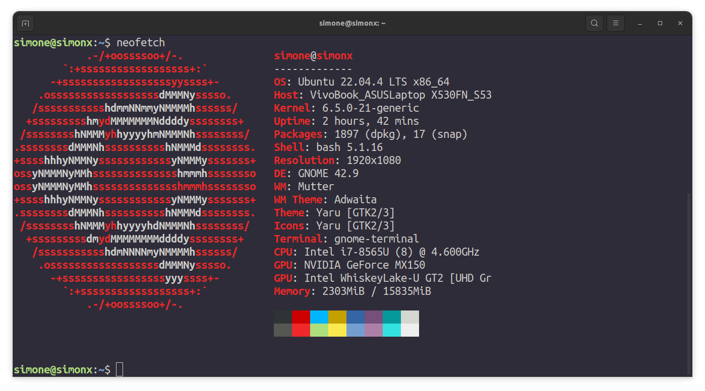

<h1 align="center">Hello there 👋, welcome to my profile! </h1>

  My name is Simone, i am an aspiring developer looking to expand my skills in various aspects of the programming world, such as penetration testing, game hacking and reverse engineering, just to name a few.

<h1 align="center">https://simonx.dev/</h1>

<h1 align="center">these are some socials im on, plus some tools i use on a daily basis </h1>

     (a bit too much for my own good)

  

 
  
  <!---  --->

<h1 align="center">some of my main languages: </h1>

    
   

